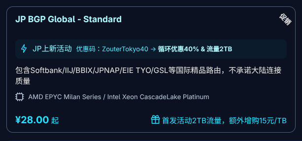
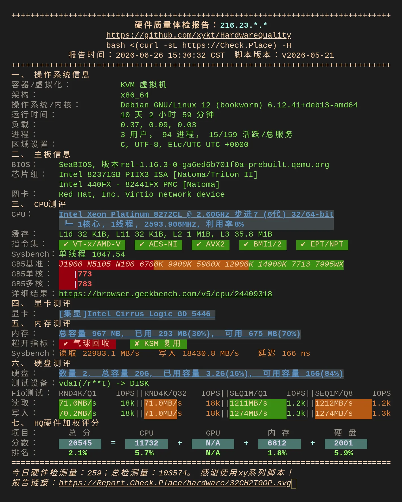
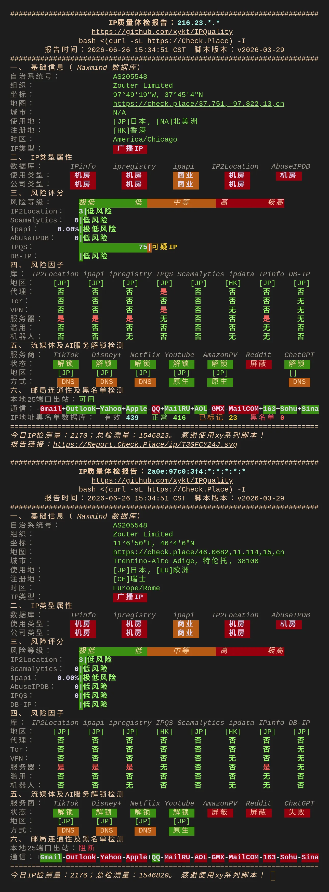
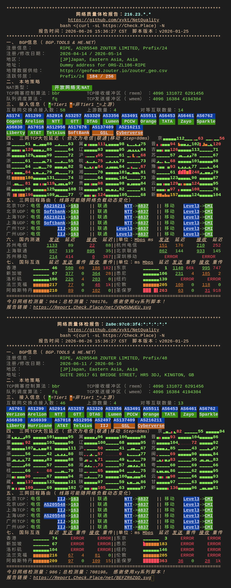
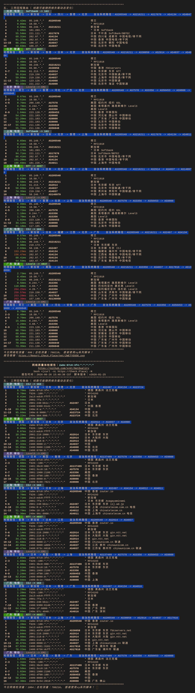
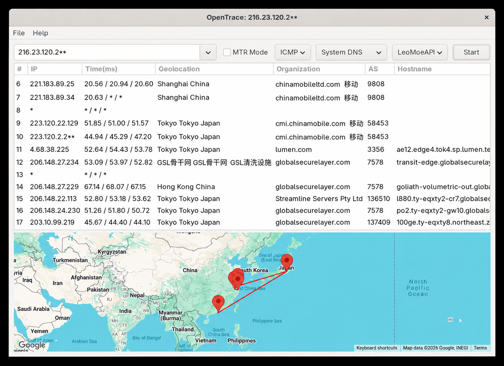
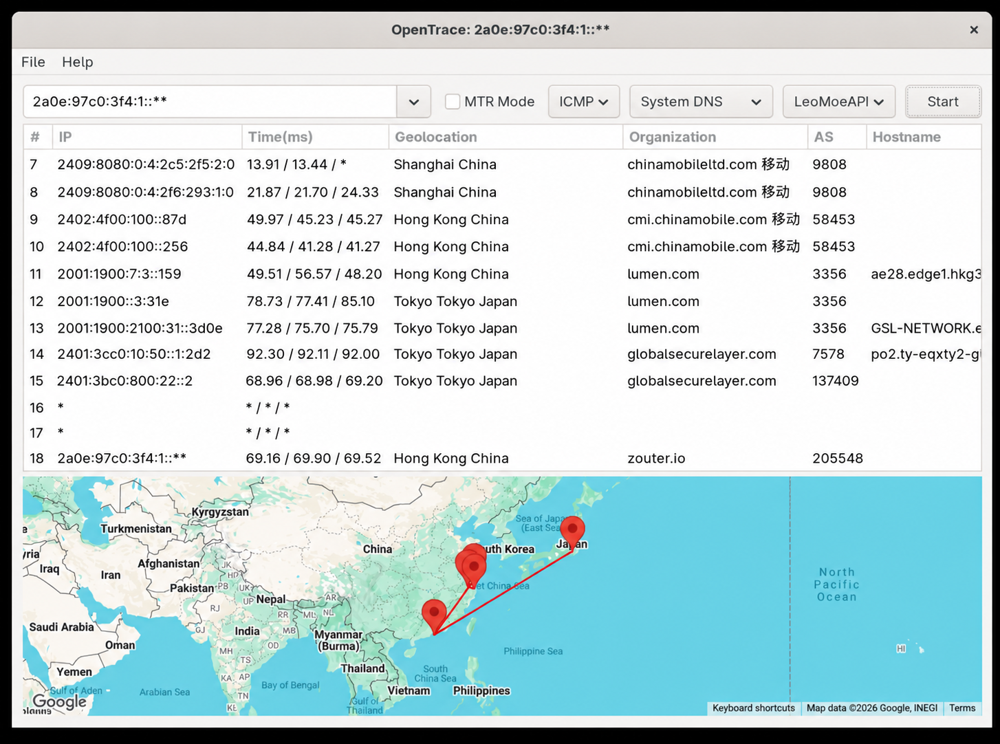

[Zouter官网](https://www.zouter.io/)


```powershell
Zouter JP BGP Global - Standard

1GB RAM
15GB SSD
1 cores CPU
1 IPv4
16 IPv6
1T Bandwidth
1000Mbps Port
Linux OS
28¥/month
```

这款是zouter新出的JP,有一个上新活动 40%循环折扣+2T流量，折扣下来每个月 `16.8¥` 

`活动日期：2026年6月18日~2026年7月1日`


   > 



   

   > 



   

   > 



   

   > 



   

>本地去程
>
>

这款机器我有幸拿到了商家内测，但是我没有发布测评，这次测试是10天后我重新跑了一边

这款JP只能说中规中矩，定位代理机，`skyline下游` 电信IIJ和softbank，联通NTT+softbank（第一次测试都是软硬）移动lumen，这个机器很难评，机器说是不承诺大陆连接，但也算个小优化机器吧，整体来看延迟会比绿云JP2222低一点，但是随着开售之后邻居多了，IP也变差了，后面只能靠DNS来解锁，一开始是原生全绿的，10天后看在探针上体现丢包比绿云还严重，不知道是人多的原因还是网络问题，在我本地移动的体感中和绿云JP2222相差不大

后面得知这款机器还有AMD版本的和原生IP的，这个我就无法测试了，论坛还有溢价收的我个人是不太理解

总结：移动联通个别地区使用体验还是可以的，2T的流量，延迟也还可以，实际体验上和绿云JP的softbank差不了太多，所以如果没有别的JP机器那么可以尝试入手体验一下，如果有JP机了，那其实没太大的必要了，绿云JP2222折算下来11/月 配置也比这个高了，16.8的价格我个人觉得还是偏贵了一些些，但是价格不能只看商品本身，需要综合评价后期机器稳定性以及商家的口碑

>推荐论坛折价收，不建议溢价


总体评价： ⭐⭐⭐✨

代理评价： ⭐⭐⭐✨

