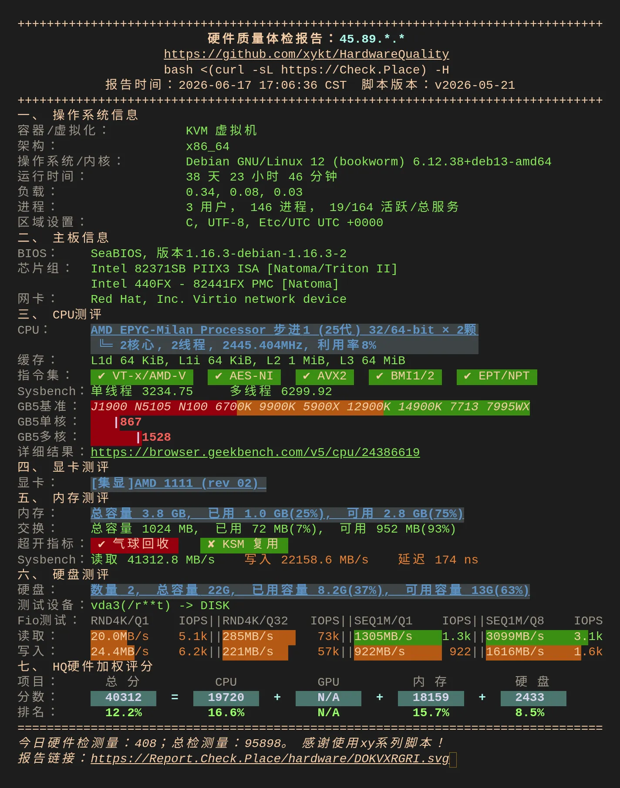
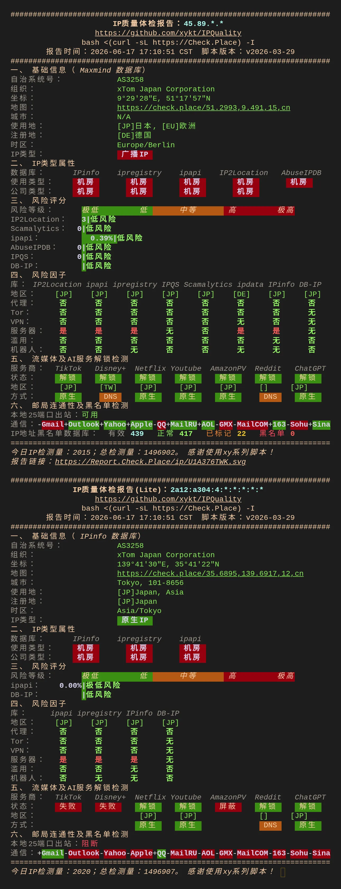
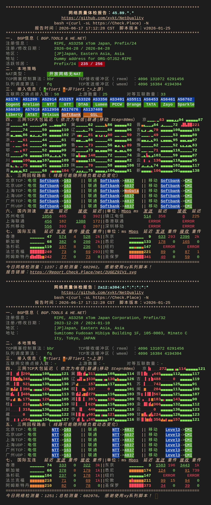
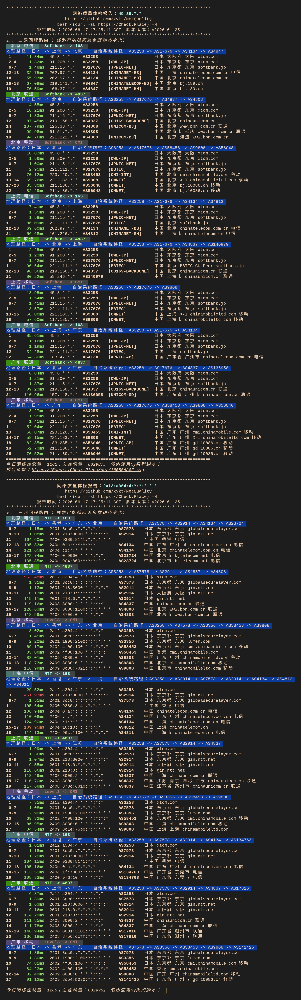
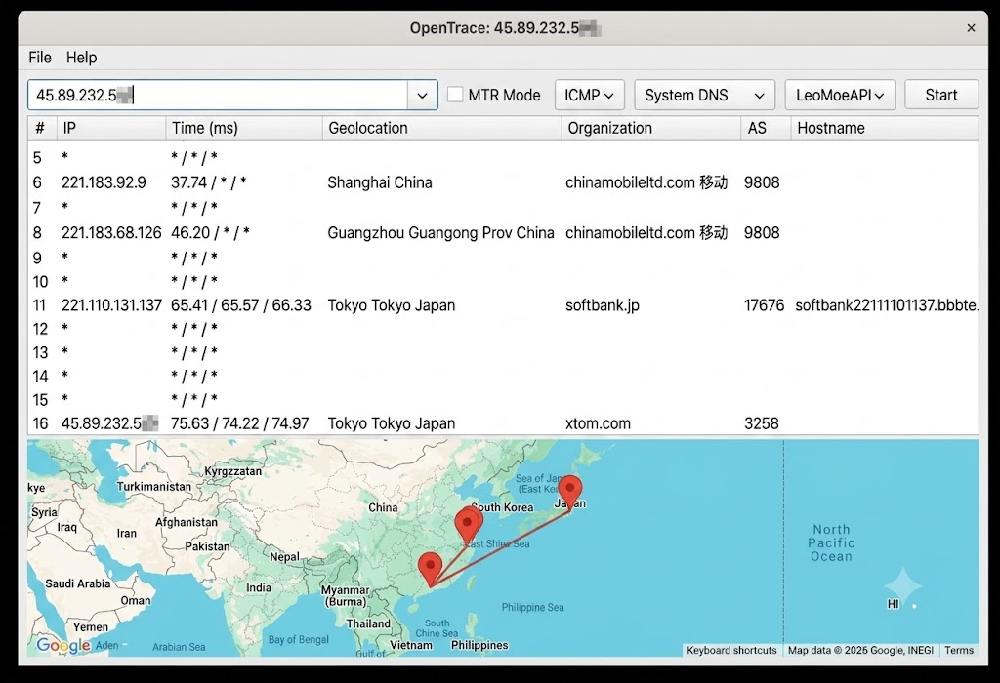
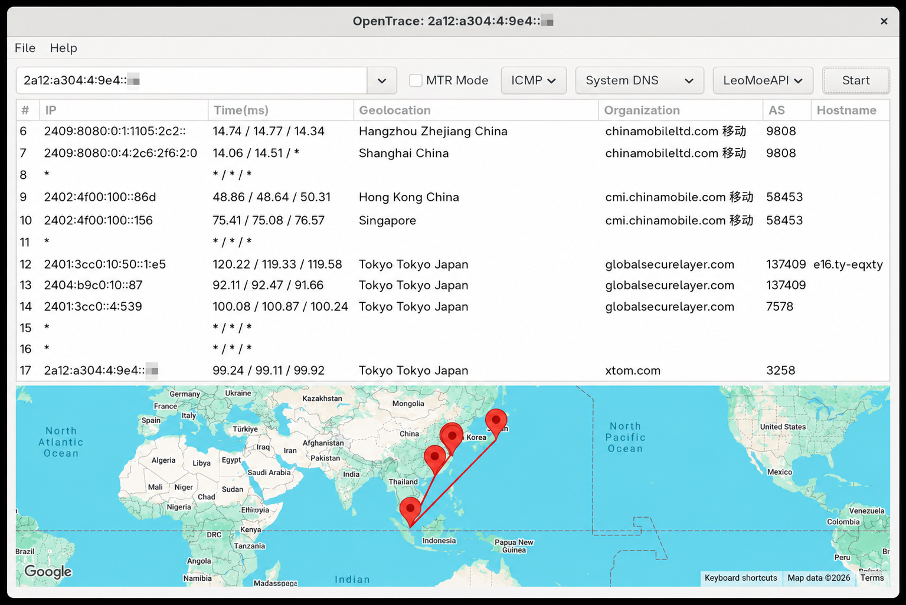

[绿云官网（aff）](https://greencloudvps.com/billing/aff.php?aff=9737)

```powershell
Black Friday 2025 - 2222 JP

4GB RAM （翻倍前2G）
20GB NVMe
2 cores CPU
1 IPv4
1 IPv6
1500G Bandwidth  (翻倍前750G)
10Gbps Port
Linux OS
22$/year
```

这款是闪购活动款，可以升级三年付60$/year，然后翻倍两个配置 这里翻倍了内存和流量

   > 



   

   > 



   

   > 



   

   > 



   

>本地去程
>
>

整体上机器还是可以的，绿云也算是正经云厂商，20刀每年，建站和部署一些小项目都没有问题
如果是纯用来代理可能性价比没那么高

上游xtom，三网softbank，`比较适合沿海地区移动和联通`，电信基本上无法使用，移动延迟稳定，但是丢包多，联通到晚上就开始过山车，但是丢包相对稳定，可以发现移动v6去程和回程是lumen，晚高峰也有不错的速度表现，v4晚高峰表现一般 移动联通平均丢包10-20%

缺点：有部分用户反应CPU性能限制比较严格，到达阈值会自动关机（个人使用没有出现过关机）

> 入手价格建议在剩余价值入手，不建议溢价收

总体评价： ⭐⭐⭐⭐

代理评价： ⭐⭐⭐✨

